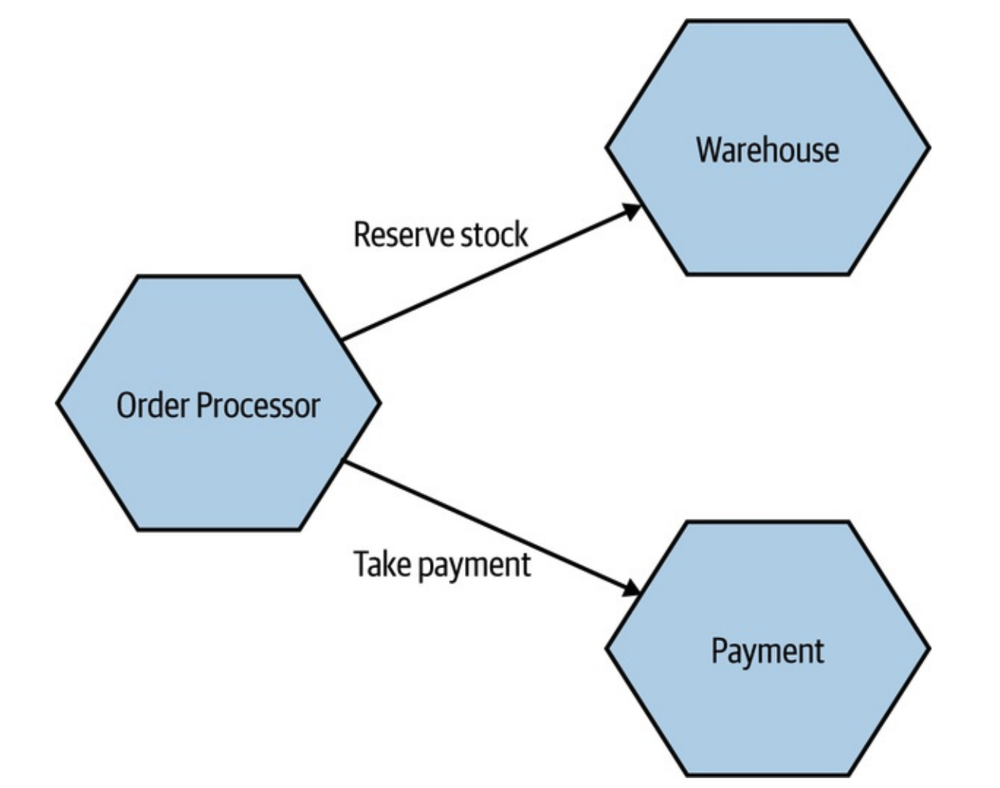
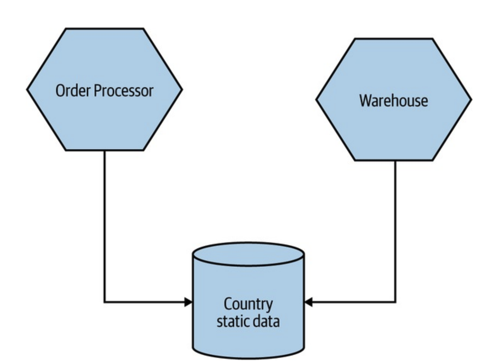
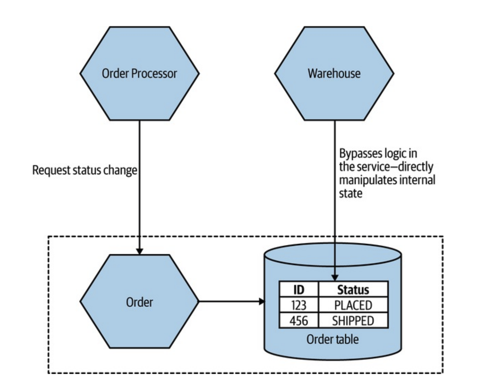
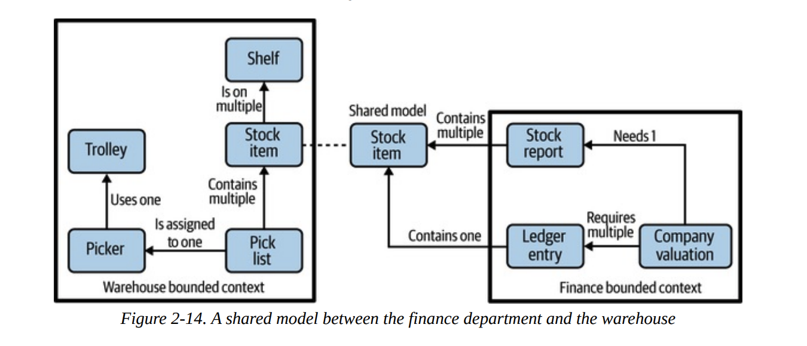
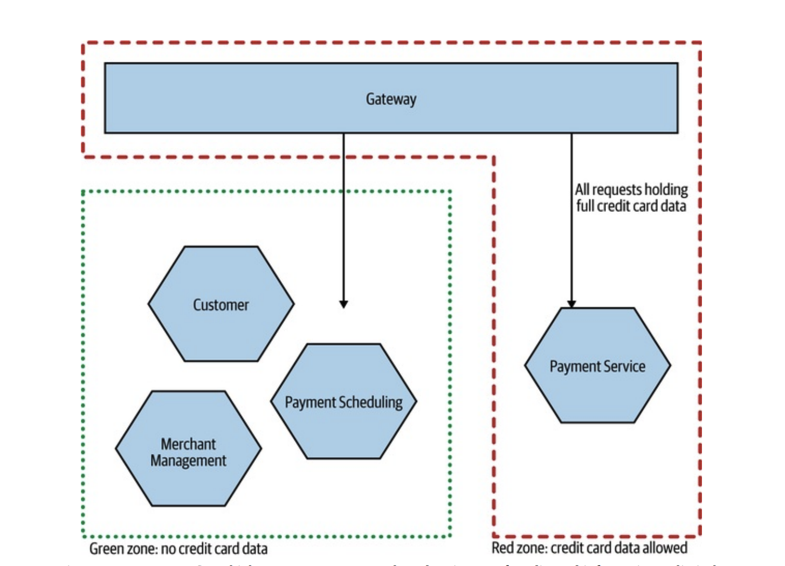
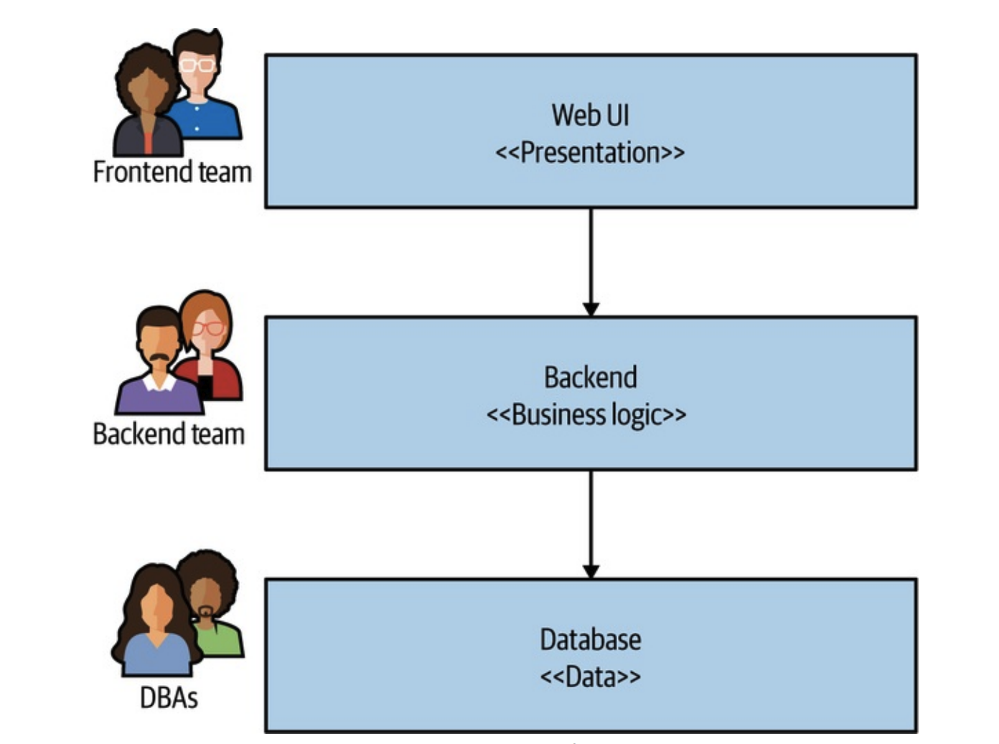

# 마이크로서비스 모델링 방법

## 🧐 마이크로서비스 모델링이란?

마이크로서비스 모델링은 복잡한 시스템을 독립적으로 배포 가능한 작은 서비스들로 분할하는 과정입니다. 이는 단순한 기술적 분할이 아닌, 비즈니스 도메인과 조직의 구조를 고려한 전략적 설계가 필요한 과정입니다.

### 모델링의 핵심 목표

- 서비스 간 독립성 확보
- 비즈니스 가치 전달 최적화
- 팀 자율성 보장
- 시스템 확장성과 유연성 확보

## 📦 마이크로서비스 경계 정의하기

마이크로서비스 아키텍처에서 경계를 설정하는 일은 서비스의 자율성을 유지하고 서로의 의존성을 최소화하는 데 매우 중요합니다. 잘 정의된 경계는 서비스의 자율성을 보장하고, 시스템의 유연성과 확장성을 향상시킵니다. 반면, 잘못 정의된 경계는 복잡성을 증가시키고 시스템의 유지보수를 어렵게 만듭니다.

### 정보 은닉

정보 은닉은 서비스의 내부 구현 세부사항을 외부로부터 숨기는 것을 의미합니다. 이는 데이터 구조, 알고리즘, 내부 상태 등을 포함합니다.

- 정보 은닉은 외부 서비스가 특정 서비스의 내부 동작에 의존하지 않도록 함으로써 **변경 영향도를 최소화**하고 서비스 간 독립성을 보장합니다.
- 내부 구현에 대한 변경이 다른 서비스에 미치는 영향을 줄여 **유지보수 비용을 낮추고** 코드 수정의 유연성을 높입니다.

정보 은닉은 단순한 캡슐화를 넘어서 각 서비스가 **비즈니스 로직을 독립적으로 유지할 수 있도록 보장**하며, 필요한 경우 API를 통해서만 데이터를 노출하게 만듭니다. 이를 통해 각 서비스가 자신의 데이터를 보호하고 특정 이벤트나 상태에 따라 로직을 변경할 수 있는 자율성을 얻습니다.

### 응집력

응집력은 서비스 내의 구성요소들이 얼마나 밀접하게 관련되어 있는지를 나타냅니다. 높은 응집력은 서비스가 명확한 책임을 가지고 있음을 의미합니다.

- 각 서비스가 명확한 단일 책임을 지니고 **관련된 기능들만 포함**할 때 응집력이 높아집니다. 예를 들어, ‘주문 서비스’는 주문 생성, 취소, 조회 등과 같은 주문 관련 로직에만 집중하고, 다른 기능들은 별도 서비스에서 처리하도록 설계합니다.
- 여러 개의 무관한 기능이 하나의 서비스 안에 포함되어 있으면 응집력이 떨어지며, 서비스 변경 시 다른 부분에 예상치 못한 영향을 줄 수 있습니다.
- 응집력이 높은 서비스는 독립적으로 테스트하고 배포하기 쉬우며, 새로운 기능을 추가할 때 내부 로직에만 영향을 미치므로 **유지보수가 용이**합니다.

### 결합

결합은 한 서비스가 다른 서비스에 얼마나 의존하는지를 나타냅니다. 낮은 결합도는 서비스의 독립성을 높이고 변경의 영향을 최소화합니다.

- 한 서비스의 변경이 다른 서비스에 영향을 미치지 않도록, 가능한 한 **자율적인 서비스들로 구성**합니다. 예를 들어, 고객 서비스가 주문 서비스와 데이터를 주고받을 때, 고객 서비스에서 직접 주문 서비스의 데이터를 조작하지 않고, API를 통해서만 접근하게 설계하는 것이 이상적입니다.
- 한 서비스가 다른 서비스의 데이터나 내부 로직을 지나치게 의존하게 되면 결합도가 높아지며, 이는 유지보수를 복잡하게 하고 서비스 간 상호작용에 따른 장애 가능성을 높입니다.

## 🔄 마이크로서비스의 결합 유형

마이크로서비스 아키텍처에서 **결합**은 서비스 간의 상호 의존성을 나타내며, 결합이 높아질수록 서비스 독립성이 낮아져 유지보수가 어려워지고 장애 발생 가능성도 커집니다. 결합 유형에는 도메인 결합, 통과 결합, 공통 결합, 내용 결합의 네 가지가 있으며, 각각의 결합 유형을 이해하고 최소화하는 것이 이상적인 마이크로서비스 설계에 필수적입니다.

### 도메인 결합

도메인 결합은 두 개 이상의 서비스가 동일한 도메인 데이터를 필요로 하고, 이를 통해 협력해야 할 때 발생합니다. 이는 특히 마이크로서비스 환경에서 서비스 간 경계를 확실히 정의하지 않으면 발생할 수 있습니다.

- 각 서비스가 특정 도메인에 대해 깊은 이해가 필요하며, 데이터를 공유해야 할 때 발생합니다.
- 도메인 주도 설계를 통해 각 서비스가 자신의 도메인 모델을 독립적으로 정의하고, 필요한 경우 API나 이벤트를 통해서만 데이터를 주고받도록 설계합니다.

### 통과 결합

통과 결합은 한 서비스가 다른 서비스의 데이터를 직접 사용하지 않지만, 데이터 전달 경로로만 사용될 때 발생합니다. 이러한 유형의 결합은 중간 경로가 추가됨으로써 복잡성과 장애 가능성을 높입니다.

- 한 서비스가 단순히 데이터를 다른 서비스로 전달하는 역할만을 수행하는 경우, 불필요한 의존성이 형성됩니다.
- 주문 서비스가 결제 서비스에 데이터를 전달해야 할 때 고객 서비스가 중간에서 데이터를 통과시키기만 한다면 통과 결합이 발생할 수 있습니다.
- 통과 결합을 피하기 위해 가능한 한 직접적인 서비스 간 상호작용 경로를 설정하거나, 이벤트 기반 아키텍처를 통해 중간 서비스 의존성을 줄일 수 있습니다.

### 공통 결합

공통 결합은 여러 서비스가 동일한 데이터를 공유할 때 발생하며, 이러한 데이터가 변경될 경우 다수의 서비스가 영향을 받을 수 있어 결합도가 높아집니다.

- 다수의 서비스가 동일한 데이터 저장소나 설정 파일에 의존하는 경우에 발생합니다.
- 고객 정보가 여러 서비스에서 직접 접근할 수 있는 공용 데이터베이스에 저장되어 있을 경우, 고객 정보 스키마가 변경되면 영향을 받는 서비스가 모두 수정되어야 합니다.
- 마이크로서비스 환경에서는 데이터베이스를 서비스별로 분리하고, 필요 시 API를 통해서만 데이터를 주고받도록 설계하여 공통 결합을 최소화합니다.

### 내용 결합

내용 결합은 가장 높은 수준의 결합으로, 한 서비스가 다른 서비스의 내부 데이터를 직접 참조하거나 수정할 때 발생합니다. 이는 마이크로서비스 아키텍처에서 반드시 피해야 하는 결합 유형입니다.

- 한 서비스가 다른 서비스의 내부 구조에 강하게 의존하고 있으며, 특정 데이터 구조나 로직 변경이 있을 경우 의존하고 있는 서비스에도 즉각적인 영향을 미칩니다.
- 서비스 A가 서비스 B의 데이터베이스에 직접 접근하여 데이터를 조작하는 경우, 서비스 B의 데이터베이스 구조가 변경되면 서비스 A도 수정이 필요해지므로 유지보수성이 떨어집니다.
- 서비스 간 상호작용은 반드시 **공식적인 인터페이스(API)**나 메시지 브로커를 통해 이루어지도록 설계해야 합니다.

## 🎯 도메인 주도 설계 적용하기

도메인 주도 설계(DDD)는 비즈니스의 복잡한 요구사항을 소프트웨어에 반영하는 것을 목표로 하며, 특히 마이크로서비스 환경에서 매우 유용한 접근 방식입니다. DDD를 통해 각 서비스는 독립적인 도메인을 책임지고, 비즈니스 로직을 일관성 있게 구현할 수 있습니다. 이를 위해 보편 언어, 애그리거트, 경계 콘텍스트 등 몇 가지 핵심 개념을 마이크로서비스에 적용할 수 있습니다.

### 보편 언어

보편 언어는 개발팀과 도메인 전문가가 공유하는 공통의 언어입니다. 이는 코드, 대화, 문서에서 일관되게 사용되어야 합니다.

**보편 언어의 중요성**

- 의사소통 오류 감소
- 도메인 모델과 구현의 일치
- 문서와 코드의 일관성 유지

### 애그리거트

애그리거트는 도메인 객체들의 군집으로, 하나의 단위로 취급되는 연관된 객체들의 묶음입니다. 애그리거트를 통해 복잡한 비즈니스 로직을 간단하게 묶어 도메인 모델의 특정 부분을 책임지며, 일관된 상태를 유지하도록 설계됩니다.

**애그리거트 특징**

- 트랜잭션 일관성 보장
- 비즈니스 규칙 캡슐화
- 불변성 유지

### 경계 콘텍스트

경계 콘텍스트는 특정 도메인 모델이 적용되는 명시적인 경계를 정의합니다. 마이크로서비스 아키텍처에서 각 서비스는 일반적으로 하나의 경계 콘텍스트에 매핑됩니다.

**경계 콘텍스트의 특징**

- 명확한 인터페이스 정의
- 콘텍스트 간 통신 규칙 설정
- 독립적인 모델 진화 가능

## 🐈 비즈니스 도메인 경계의 대안

마이크로서비스의 경계를 정의할 때 반드시 비즈니스 도메인 경계만을 따를 필요는 없습니다. 때로는 다른 기준들이 더 적절할 수 있으며, 이러한 대안적 접근 방식들을 이해하고 상황에 맞게 적용하는 것이 중요합니다.

### 변동성

변동성은 시스템의 특정 부분이 얼마나 자주 또는 빠르게 변화하는지를 나타냅니다. 변동성에 기반한 서비스 분리는 변화의 속도가 다른 컴포넌트들을 효과적으로 격리할 수 있게 해줍니다. 변화의 빈도와 속도가 높은 비즈니스 기능일수록 독립된 서비스로 분리하는 것이 유리합니다.

- 목적: 자주 변하는 비즈니스 로직을 독립적인 마이크로서비스로 설정함으로써, 해당 서비스만 변경해도 시스템의 다른 부분에 영향을 미치지 않도록 합니다.
- 적용 예시: 마케팅 캠페인 서비스와 같은 고빈도 업데이트가 필요한 서비스는 독립된 서비스로 나누어, 프로모션 및 할인 정책을 빠르게 변경할 수 있도록 지원합니다.
- 장점: 독립된 서비스로 변동성을 관리함으로써 비즈니스 요구사항에 대한 빠른 대응과 안정적인 배포가 가능해집니다.

### 데이터

데이터는 서비스 경계 설정의 또 다른 주요 요소로, 데이터의 소유와 접근 권한이 명확히 구분되어야 합니다. 특정 데이터가 주요 자산이 되는 경우, 이를 관리하는 독립적인 서비스가 필요합니다.

- 목적: 각 마이크로서비스가 자체 데이터베이스를 통해 데이터를 독립적으로 관리하게 하여 데이터 일관성과 보안성을 보장합니다.
- 적용 예시: 고객 정보와 같은 중요한 데이터는 고객 관리 서비스에서만 소유하며, 외부 서비스와는 필요한 경우에만 데이터의 일부분을 제공하도록 합니다.
- 장점: 데이터와 도메인이 분리되면 서비스 간 데이터 공유가 명확해지고, 시스템 내 데이터 접근 권한과 보안 수준을 쉽게 관리할 수 있습니다.

### 기술

특정 기술적 요구사항이나 제약조건에 기반하여 서비스를 분리할 수 있습니다. 특정 기술 요건이 다를 경우, 이를 경계로 활용하여 서로 다른 기술 스택을 사용하는 서비스로 분리할 수 있습니다.

- 목적: 각 서비스가 필요한 기술 스택을 선택하여 최적화된 성능과 기능을 제공하도록 돕습니다.
- 적용 예시: 분석 서비스에는 대규모 데이터 처리를 위한 빅데이터 기술을, 트랜잭션 서비스에는 빠른 응답 속도를 제공하는 경량 기술 스택을 사용하는 식으로 구분할 수 있습니다.
- 장점: 각 서비스가 목적에 맞는 기술을 사용하여 서비스 성능과 확장성을 극대화할 수 있습니다.

### 조직

조직의 구조와 팀의 역량 또한 서비스 경계를 설정하는 데 중요한 기준이 됩니다. 이를 통해 각 팀이 담당하는 서비스를 독립적으로 관리하고, 책임 소재를 명확히 할 수 있습니다.

- 목적: 조직 내 팀 구성을 서비스 경계로 설정하여, 각 팀이 자율적으로 해당 서비스를 운영하고 관리하도록 돕습니다.
- 적용 예시: 고객 지원 팀은 고객 관리 서비스를 담당하고, 결제 팀은 결제 서비스를 담당하는 등 각 서비스는 해당 팀이 완전히 책임지는 구조로 나눌 수 있습니다.
- 장점: 팀별로 명확한 역할과 책임이 부여되어 개발 속도와 책임성이 높아지며, 협업 시 복잡성을 줄일 수 있습니다.

## 🔚 결론

마이크로서비스 모델링은 시스템의 복잡한 비즈니스 요구사항을 효과적으로 분리하고 관리하는 핵심 전략입니다. 도메인 주도 설계(DDD), 결합과 응집력, 그리고 비즈니스 도메인 경계 설정과 같은 개념들은 서비스 간 독립성을 보장하고, 유지보수와 확장성을 고려한 견고한 아키텍처를 구축하는 데 필수적입니다.

- 서비스의 독립성: 정보 은닉과 낮은 결합도를 통해 각 서비스는 자신의 책임에만 집중하고, 다른 서비스의 변화로 인한 영향을 최소화할 수 있습니다.
- 도메인에 맞춘 경계 설정: 도메인 주도 설계를 활용해 보편 언어, 애그리거트, 경계 콘텍스트를 각 서비스에 적용함으로써 비즈니스와 기술 간의 일관성을 높이고 커뮤니케이션의 원활함을 유지합니다.
- 유연한 경계 설정 기준: 변동성, 데이터, 기술, 조직과 같은 기준을 통해 마이크로서비스의 경계를 유연하게 설정함으로써 다양한 비즈니스 변화와 기술적 요구사항에 유연하게 대응할 수 있습니다.

이러한 원칙을 통해 설계된 마이크로서비스 아키텍처는 서비스 간 결합을 최소화하고 응집력을 높여, 비즈니스 변화에 대응하는 속도와 유지보수성을 크게 향상시킬 수 있습니다. 최적의 모델링 방식은 상황에 따라 다를 수 있지만, 올바른 도구와 원칙을 적용하면 더욱 확장 가능하고 복원력 있는 시스템을 구축할 수 있습니다.

## 📚 참고 자료

- [마이크로서비스 아키텍처 구축 (전면 개정판)](https://product.kyobobook.co.kr/detail/S000202596905)
- [Domain-Driven Design: Tackling Complexity in the Heart of Software](https://www.pearson.com/store/p/domain-driven-design-tackling-complexity-in-the-heart-of-software/P100000923439)
