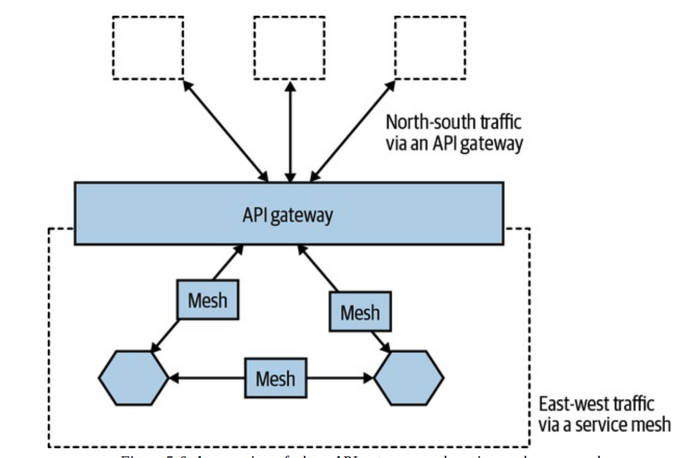

# 마이크로서비스의 통신 구현

## 🗺️ 이상적인 기술을 찾아서

마이크로서비스 아키텍처에서 서비스 간 통신은 시스템의 성능, 확장성, 유지보수성에 큰 영향을 미칩니다. 따라서 통신 기술을 선택할 때는 신중한 고려가 필요합니다.

### 주요 통신 기술 옵션

- SOAP (Simple Object Access Protocol)
- XML-RPC (XML Remote Procedure Call)
- REST (Representational State Transfer)
- gRPC (Google Remote Procedure Call)

### 기술 선택 시 고려사항

항상 새로운 선택지가 등장하기 때문에 특정 기술을 논의하기 전에 선택한 기술에서 무엇을 원하는지 고민을 해야 합니다.

1. **하위 호환성**

   - API 버전 관리 용이성
   - 기존 클라이언트 지원 유지
   - 점진적 업그레이드 가능성

2. **명시적 인터페이스**

   - 명확한 계약 정의
   - 문서화 용이성
   - 타입 안정성

3. **기술 중립성**

   - 특정 플랫폼/언어 독립성
   - 다양한 클라이언트 지원
   - 향후 기술 변경 유연성

4. **단순성**

   - 사용하기 쉬운 API
   - 직관적인 인터페이스
   - 낮은 학습 곡선

5. **캡슐화**
   - 내부 구현 세부사항 은닉
   - 서비스 독립성 유지
   - 변경 영향도 최소화

## 🧐 기술 선택

다양한 기술 선택지 중에서 가장 대중적이고 흥미로운 선택지들에 대해 알아보겠습니다.

### 원격 프로시저 호출 (RPC)

RPC는 원격 프로세스의 메서드를 로컬처럼 호출하는 방식으로, SOAP와 gRPC가 대표적입니다.

**SOAP**

보안과 신뢰성이 중요한 금융 시스템 등에 유리합니다.

    - 복잡한 구현과 무거운 메시지 형식
    - XML 기반의 메시지 프로토콜
    - 풍부한 표준 지원
    - 엄격한 계약 정의

**gRPC**

낮은 대기 시간과 고속 처리가 요구되는 서비스에 적합합니다.

    - Protocol Buffers 사용
    - 높은 성능과 낮은 지연시간
    - 양방향 스트리밍 지원
    - 강력한 타입 시스템

### REST

REST는 URL을 통한 리소스 접근과 HTTP 메서드를 활용한 CRUD 연산으로 마이크로서비스를 설계하는 데 널리 사용됩니다. JSON 포맷으로 직렬화하며, 클라이언트와 서버의 결합도가 낮아 유연하게 확장할 수 있습니다.

- 리소스 중심 아키텍처
- 표준 HTTP 메소드 사용
- 상태를 저장하지 않음
- 캐시 가능성
- 계층화된 시스템

### GraphQL

GraphQL은 소비자가 원하는 데이터를 직접 쿼리할 수 있어, 여러 마이크로서비스에서 데이터를 집계하고 선택적으로 전달하는 데 유리합니다.

- 유연한 데이터 요청
- 단일 엔드포인트
- 강력한 타입 시스템
- 실시간 구독 기능

### 메시지 브로커

RabbitMQ나 Kafka와 같은 메시지 브로커를 통해 비동기 메시징을 구현할 수 있으며, 마이크로서비스 간에 이벤트 기반 아키텍처를 구성할 때 활용됩니다.

- 메시지 큐잉
- 발행/구독 패턴
- 메시지 지속성
- 전달 보장
- 장애 복구

## 🔤 직렬화 포맷

데이터 직렬화는 전송 속도와 효율성에 큰 영향을 미칩니다. 상황에 따라 텍스트 포맷이나 바이너리 포맷을 선택할 수 있습니다.

### 텍스트 포맷

**JSON**

사람과 기계 모두 쉽게 이해할 수 있는 직렬화 포맷으로 REST API와 자주 함께 사용됩니다.

    - 읽기 쉽고 디버깅 용이
    - 널리 지원되는 표준
    - 상대적으로 큰 메시지 크기

**XML**

스키마 기반 검증이 필요한 경우 활용되며, SOAP 프로토콜에서 주로 사용됩니다.

    - 풍부한 메타데이터
    - 복잡한 데이터 구조 표현
    - 처리 오버헤드 높음

### 바이너리 포맷

**Protocol Buffers**

gRPC와 함께 사용되는 구글의 직렬화 포맷으로, XML이나 JSON보다 효율적입니다.

    - 작은 메시지 크기
    - 빠른 직렬화/역직렬화
    - 강력한 스키마 지원

**Avro**

스키마를 포함하여 데이터 구조를 정의하는 포맷으로, 데이터 압축 효율이 높아 Kafka 등에서 활용됩니다.

    - 동적 스키마 지원
    - 효율적인 직렬화
    - 스키마 진화 용이

## 📑 스키마

스키마는 서비스 간 통신에서 데이터의 구조와 형식을 정의하는 계약입니다. 마이크로서비스 환경에서 스키마는 서비스 간 안정적인 통신을 보장하고 변경 관리를 용이하게 합니다.

### 스키마의 필요성

1. **통신 안정성**

- 데이터 구조의 일관성 보장
- 타입 안전성 제공
- 버전 관리 용이성

2. **문서화**

- API 계약의 명확한 정의
- 자동화된 문서 생성
- 팀 간 커뮤니케이션 향상

3. **개발 생산성**

- 코드 생성 자동화
- 테스트 용이성
- 빠른 통합 및 디버깅

### 구조적 계약 위반 vs 의미적 계약 위반

**구조적 계약 위반**

필드의 타입이 변경되거나 필수 필드가 누락될 때 발생하는 문제로, 스키마 검증 단계에서 쉽게 발견할 수 있습니다.

    - 즉각적인 오류 발생
    - 쉽게 감지 가능
    - 자동화된 검증 가능

**의미적 계약 위반**

데이터 구조는 맞지만 데이터 값이 예상과 다를 때 발생합니다. 예를 들어, 주문 상태가 잘못된 상태 코드로 표시될 경우 구조적으로는 문제가 없지만 의미적으로는 오류가 생깁니다. 이러한 의미적 오류는 자동 검증이 어려우므로 추가적인 테스트와 문서화가 필요합니다.

    - 감지하기 어려움
    - 비즈니스 로직 오류 유발
    - 런타임에 문제 발생

### 명시적 스키마의 중요성

명시적 스키마를 사용하면 데이터 형식을 강제할 수 있으며, 버전 관리를 통해 데이터 형식을 유연하게 변경할 수 있습니다.

1. **계약 정의**

- 명확한 데이터 구조 정의
- 필드의 타입과 제약조건 명시
- 필수/선택 필드 구분

2. **버전 관리**

- 하위 호환성 보장
- 점진적 변경 지원
- 마이그레이션 경로 제공

3. **검증 자동화**

- 컴파일 타임 검증
- 런타임 유효성 검사
- 테스트 자동화

## 🚫 중단 변경 피하기

마이크로서비스 환경에서 서비스 간 통신이 중단되는 것을 방지하는 것은 매우 중요합니다.

### 확장 변경 (Expansion Changes)

확장 변경은 기존 기능을 유지하면서 새로운 기능을 추가하는 방식입니다.

- 선택적 필드 추가
- 새로운 엔드포인트 추가
- 기존 필드의 값 범위 확장

### 관대한 독자 (Tolerant Reader)

포스텔의 법칙을 따르는 설계 원칙으로, "당신이 하는 일에는 엄격하고, 남에게서 받아들일 때는 너그럽게 하라"라고 선언합니다. 예상치 못한 데이터에도 유연하게 대처하는 소비자 설계를 의미합니다.

- 클라이언트가 필요하지 않은 필드를 무시하도록 구현
- 서버는 기존 필드의 제거를 지양하고, 클라이언트는 변경된 스키마를 처리할 수 있도록 설계

### 명시적 인터페이스 (Explicit Interface)

명확한 인터페이스는 중단 변경을 방지하는 중요한 역할을 하며 서비스 간 계약을 명확하게 정의하고 문서화합니다.

- 스키마 문서화
- 정적 검증 도구 활용

### 우발적 중단 변경을 일찍 발견하기

변경으로 인한 문제를 조기에 발견하기 위한 전략입니다.

- 소비자 주도 계약 테스트
- 통합 테스트 자동화

## 🔄 중단 변경 관리하기

### 락스텝 배포

모든 관련 서비스를 동시에 업데이트하는 방식입니다.

**장점**

- 일관성 보장
- 버전 관리 단순화
- 테스트 용이성

**단점**

- 배포 복잡성 증가
- 서비스 독립성 저하
- 위험도 증가

### 호환되지 않는 마이크로서비스 버전의 공존

여러 버전의 서비스를 동시에 운영하는 전략입니다. 새 버전의 인터페이스를 도입하더라도 기존 클라이언트가 계속 작동하도록 하여 버전 간 공존을 허용합니다.

**URI 버저닝**

- /v1/orders
- /v2/orders

**미디어 타입 버저닝**

- Accept: application/vnd.company.orders-v1+json
- Accept: application/vnd.company.orders-v2+json

**헤더 기반 버저닝**

- X-API-Version: 1
- X-API-Version: 2

### 기존 인터페이스 에뮬레이션

이전 버전의 인터페이스를 새로운 버전에서 지원하는 방식입니다. 새로운 인터페이스에서 이전 인터페이스의 동작을 모방하여 하위 호환성을 제공합니다.

- API 게이트웨이를 통해 버전 간 변환을 처리
- 이전 버전의 요청을 새로운 버전의 요청으로 변환

## 🔴 마이크로서비스 세계에서 DRY와 코드 재사용성의 위험

마이크로서비스 환경에서 과도한 코드 재사용은 서비스 간 결합도를 높일 수 있습니다. DRY 원칙을 맹목적으로 따르는 것보다 독립성과 자율성을 유지하는 것이 중요합니다.

- 서비스 경계 내에서만 DRY 적용
- 공유 라이브러리 최소화
- 복제 허용 (Copying > Coupling)

## 🔍 서비스 디스커버리

서비스 디스커버리는 동적으로 변하는 서비스 위치를 찾는 데 필요한 메커니즘입니다.

### 도메인 네임 시스템 (DNS)

DNS는 가장 기본적인 서비스 디스커버리 메커니즘입니다.

**장점**

- 널리 사용되는 표준
- 기존 인프라 활용 가능
- 간단한 구현
- 높은 신뢰성

**단점**

- DNS 레코드 캐시로 인한 지연
- 세부적인 트래픽 제어 한계

### 동적 서비스 레지스트리

DNS의 한계를 극복하기 위해 등장한 전문화된 서비스 디스커버리 솔루션입니다.

- 자동 서비스 등록
- 상태 모니터링
- 고급 라우팅

**Consul**

    - 분산 구성 관리
    - 강력한 일관성
    - 내장된 DNS 서버
    - 다중 데이터센터 지원

**Etcd**

    - 분산 키-값 저장소
    - 강력한 일관성 보장
    - 가벼운 구조
    - Kubernetes 통합

**Zookeeper**

    - 높은 신뢰성
    - 분산 조정 서비스
    - 복잡한 구성
    - 성숙한 생태계

## 🌐 서비스 메시와 API 게이트웨이

마이크로서비스가 성장함에 따라 서비스 간 통신의 복잡성을 관리하기 위한 인프라 계층이 필요해졌습니다. 서비스 메시와 API 게이트웨이는 마이크로서비스 간 통신을 관리하고 최적화하는 데 필수적인 컴포넌트입니다.

### 서비스 메시

서비스 메시는 마이크로서비스 간의 통신을 안전하고 신뢰할 수 있게 만드는 전용 인프라 계층입니다. 각 서비스에 사이드카 프록시를 배포하여 서비스 간 통신을 처리하고, 이를 중앙에서 제어하고 관찰할 수 있게 합니다.

**주요 역할**

- 서비스 간 통신의 신뢰성 보장
- 트래픽 제어 및 라우팅
- 보안 정책 적용
- 서비스 관찰 및 모니터링

**핵심 기능**

1.  트래픽 관리

        - 로드 밸런싱
        - 서킷 브레이킹
        - 타임아웃 및 재시도
        - 장애 주입 테스트

2.  보안

        - 서비스 간 인증
        - 통신 암호화
        - 접근 제어

3.  모니터링

        - 트래픽 흐름 시각화
        - 성능 메트릭 수집
        - 분산 추적

### API 게이트웨이

API 게이트웨이는 클라이언트와 마이크로서비스 사이의 단일 진입점 역할을 하는 서버입니다. 클라이언트 요청을 적절한 서비스로 라우팅하고, 여러 서비스의 응답을 조합하여 클라이언트에게 전달합니다.

**주요 역할**

- 클라이언트 요청의 중앙 집중식 처리
- API 버전 관리 및 문서화
- 인증/인가 처리
- 응답 데이터 변환 및 조합

**핵심 기능**

1.  라우팅

        - 요청 경로 기반 라우팅
        - 로드 밸런싱
        - 프로토콜 변환

2.  보안

        - 인증 및 권한 부여
        - API 키 관리
        - 속도 제한

3.  요청/응답 처리

        - 응답 캐싱
        - 데이터 변환
        - 에러 처리

### 차이점과 상호 보완성

- 서비스 메시는 내부 서비스 간 통신을 관리
- API 게이트웨이는 외부 클라이언트와의 통신을 관리
- 두 패턴은 함께 사용되어 완전한 통신 인프라 구성

## 결론

마이크로서비스 통신을 구현하는 과정은 기술 선택, 스키마 관리, 중단 변경 방지 등 다양한 측면에서 전략적 판단이 요구됩니다. 안정적인 통신과 유지보수를 위해 설계 단계에서부터 세심한 고려가 필요하며, 확장 가능한 구조와 하위 호환성을 중심으로 설계하는 것이 중요합니다.

## 📚 참고 자료

- [마이크로서비스 아키텍처 구축 (전면 개정판)](https://product.kyobobook.co.kr/detail/S000202596905)
