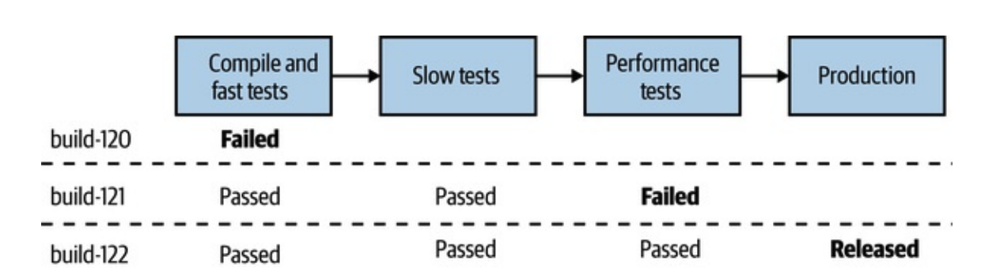
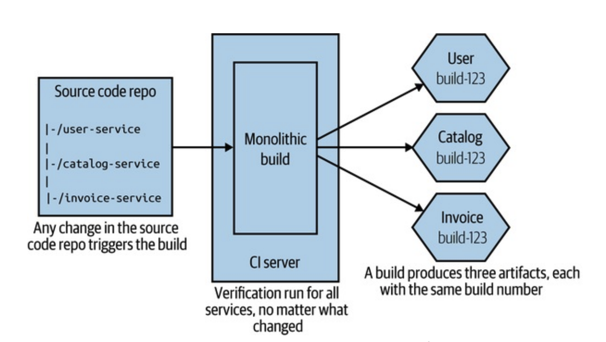
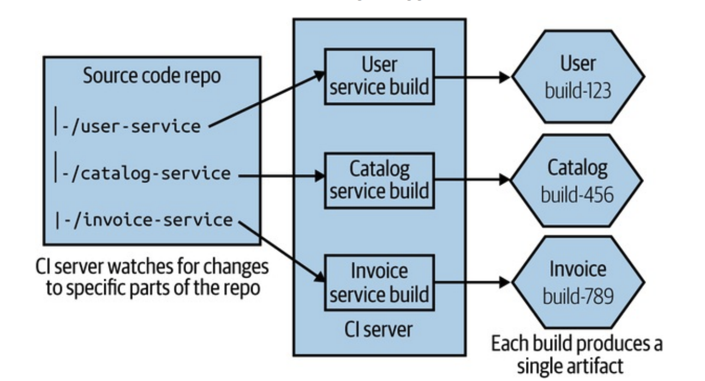
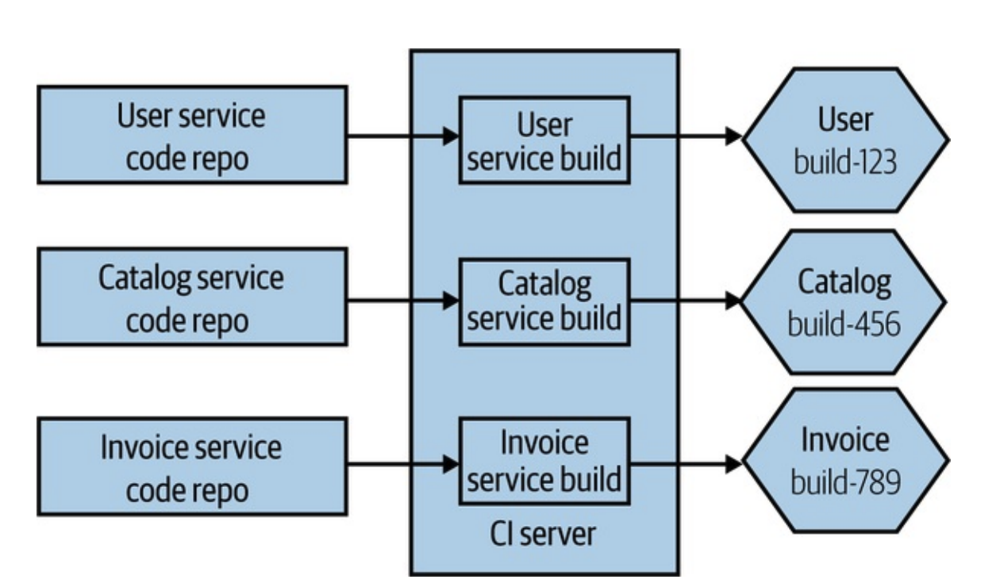

# 빌드

## 🧐 마이크로서비스에서 빌드란?

마이크로서비스 환경에서의 빌드는 단순한 코드 컴파일 이상을 의미합니다. 이는 코드 통합, 테스트, 패키징, 배포에 이르는 전체 프로세스를 포함하며, 각 서비스의 독립성을 보장하면서도 전체 시스템의 일관성을 유지해야 합니다.

## ↩️ CI의 오해와 진실

지속적 통합(CI)은 많은 조직에서 실천한다고 주장하지만, 실제로는 도구만 도입하고 진정한 의미의 CI를 실천하지 않는 경우가 많습니다. 지속적 통합(CI)은 단순히 빌드를 자동화하거나 코드를 자주 병합하는 것을 넘어, 팀이 협력하여 높은 코드 품질을 유지하도록 하는 문화와 기술적 프로세스를 포함합니다.

### 실제 CI의 핵심 원칙

**빈번한 통합**

- 하루에 최소 한 번 이상 메인라인에 통합
- 작은 단위의 변경사항 자주 커밋
- 장기 실행 브랜치 지양

**자동화된 검증**

- 모든 커밋에 대한 자동 테스트 실행
- 빌드 및 테스트 자동화
- 품질 게이트 설정

**신속한 피드백**

- 빌드 실패 시 즉각적인 알림
- 빠른 빌드 수정 우선순위
- 팀 전체의 책임의식

### 브랜치 전략

#### 깃플로우

- 기능 브랜치 기반 개발
- 복잡한 브랜치 구조
- 장기 실행 브랜치 위험

**장점**

- 명확한 릴리스 관리
- 안정적인 프로덕션 코드
- 체계적인 버전 관리

**단점**

- 통합 지연
- 병합 충돌 증가
- CI 원칙과 충돌

#### 트렁크 기반 개발

- 메인라인 중심 개발
- 짧은 수명의 피처 브랜치
- 지속적 통합 강조

**장점**

- 빠른 피드백
- 작은 단위의 변경
- 통합 문제 조기 발견

**단점**

- 더 높은 기술적 숙련도 요구
- 피처 토글 관리 필요
- 초기 안정성 위험

## 🔃 빌드 파이프라인과 지속적 제공

### 단계별 빌드 파이프라인의 가치

빌드 파이프라인은 변경 사항이 배포 가능한 상태인지 확인하는 일련의 단계를 포함합니다.

- 코드 빌드: 코드를 컴파일하고 종속성을 해결
- 유닛 테스트: 코드의 개별 컴포넌트가 올바르게 동작하는지 검증
- 통합 테스트: 서비스 간의 상호작용을 검증
- 배포 준비: 배포 가능한 아티팩트를 생성

### 지속적 제공의 핵심 요소

지속적 제공은 빌드 파이프라인을 통해 언제든지 배포 가능한 상태를 유지하는 것을 목표로 합니다.

**자동화**

- 일관된 프로세스
- 인적 오류 감소
- 반복 가능한 배포

**환경 일관성**

- 환경 구성 자동화
- 설정 관리
- 인프라 as 코드

**품질 게이트**

- 자동화된 검증
- 명확한 승인 기준
- 단계별 제어

### 절충점과 환경

빌드와 배포 과정에서 환경 간 차이를 고려해야 합니다.

- 개발 환경: 빠른 피드백 제공을 위해 간소화된 설정
- 스테이징 환경: 실제 배포 환경과 동일하게 구성하여 테스트 신뢰성 확보
- 프로덕션 환경: 철저한 모니터링과 롤백 전략 준비

## 🛠️ 소스 코드와 빌드 매핑 전략

### 거대한 리포지터리 하나와 거대한 빌드

단일 리포지터리와 빌드 프로세스를 사용하는 방식은 초기에는 간단하지만, 다음과 같은 문제를 초래할 수 있습니다.

- 느린 빌드 시간
- 서비스 간 종속성 증가
- 특정 서비스 변경으로 전체 빌드가 영향을 받음

### 모노레포 접근

모든 마이크로서비스를 하나의 리포지터리에 관리하지만, 서비스별 빌드와 테스트 파이프라인을 분리합니다.

**장점**

- 통합 용이성
- 도구 표준화
- 코드 재사용 편의

**단점**

- 리포지터리 크기 증가
- 빌드 시간 증가
- 접근 제어 어려움

### 멀티레포 접근

각 마이크로서비스가 자체 리포지터리와 빌드 파이프라인을 가지는 방식입니다.

**장점**

- 서비스 독립성
- 명확한 경계
- 팀 자율성

**단점**

- 코드 공유 어려움
- 도구 중복
- 의존성 관리 복잡

### 선택 기준

**조직적 요소**

- 팀 구조
- 협업 방식
- 자율성 수준

**기술적 요소**

- 코드베이스 크기
- 빌드 복잡도
- 도구 생태계

**운영적 요소**

- 배포 주기
- 변경 관리
- 모니터링 요구사항

## 🎯 결론

마이크로서비스에서 빌드는 단순한 코드 컴파일 이상의 의미를 가지며, CI와 CD의 핵심 구성 요소입니다. 적절한 브랜치 모델과 빌드 파이프라인을 설정하고, 서비스 특성에 맞는 소스 코드 관리 방식을 선택하는 것이 중요합니다. 이를 통해 변경 사항을 신속하고 안전하게 배포하며, 시스템의 유연성과 안정성을 확보할 수 있습니다.

## 📚 참고 자료

- [마이크로서비스 아키텍처 구축 (전면 개정판)](https://product.kyobobook.co.kr/detail/S000202596905)
