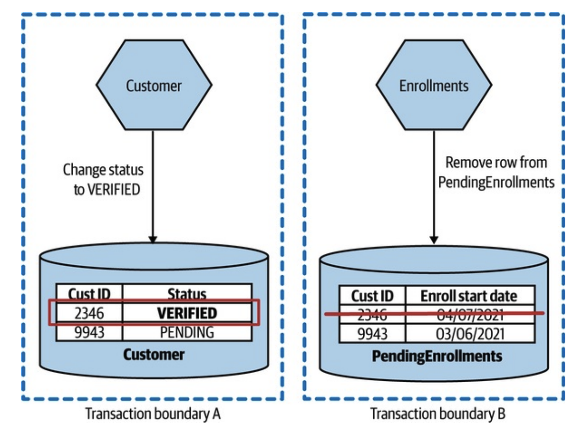
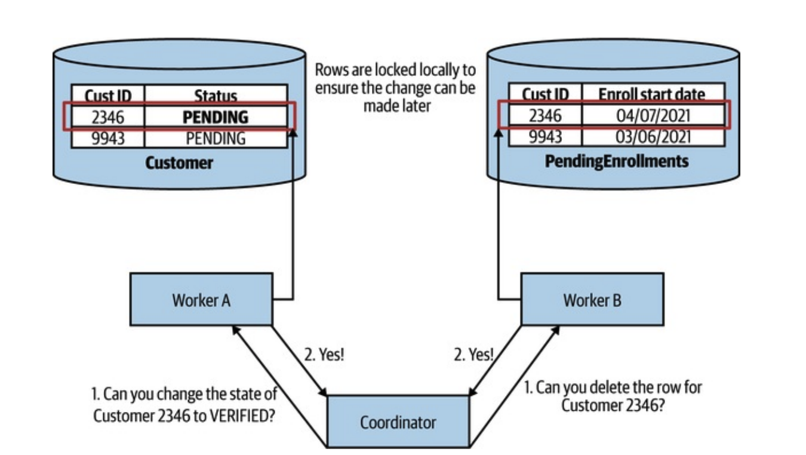
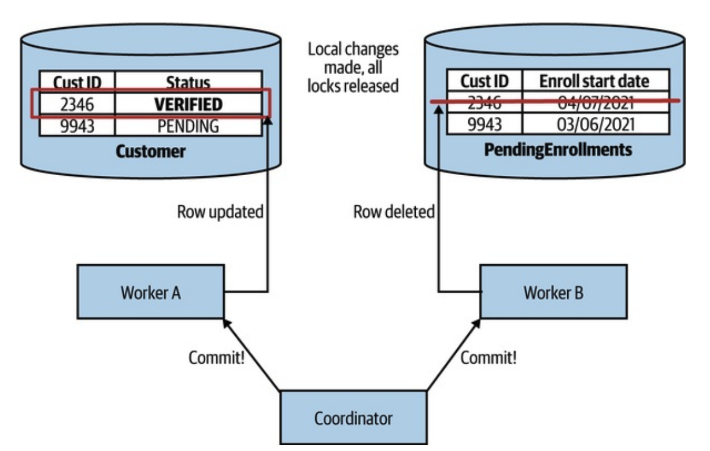

# 워크플로

## 🧐 마이크로서비스에서 트랜잭션이란?

마이크로서비스 환경에서는 하나의 비즈니스 트랜잭션이 여러 서비스에 걸쳐 수행되는 경우가 많습니다. 이러한 분산 환경에서 데이터의 일관성을 유지하고 트랜잭션을 관리하는 방법에 대해 알아보겠습니다.

## 🔄 데이터베이스 트랜잭션

전통적인 모놀리식 애플리케이션에서는 ACID 트랜잭션을 통해 데이터 일관성을 보장했습니다. 그러나 마이크로서비스 환경에서는 이러한 접근이 어려워졌습니다.

### ACID 트랜잭션

ACID는 데이터베이스 트랜잭션이 보장해야 하는 네 가지 핵심 특성을 나타냅니다.

**원자성 (Atomicity)**
트랜잭션의 모든 연산은 전부 성공하거나 전부 실패해야 합니다. 트랜잭션 중간에 실패가 발생하면 이전까지의 모든 변경사항이 롤백됩니다.

**일관성 (Consistency)**
트랜잭션은 데이터베이스를 한 일관된 상태에서 다른 일관된 상태로 변경해야 합니다. 모든 제약조건과 규칙이 준수되어야 합니다.

**격리성 (Isolation)**
동시에 실행되는 트랜잭션들은 서로 영향을 주지 않아야 합니다. 각 트랜잭션은 다른 트랜잭션의 중간 상태를 볼 수 없습니다.

**내구성 (Durability)**
성공적으로 완료된 트랜잭션의 결과는 영구적으로 저장되어야 합니다. 시스템 장애가 발생하더라도 데이터는 보존되어야 합니다.

### 왜 원자성이 부족한가?

마이크로서비스 아키텍처에서는 각 서비스가 독립적으로 동작하며 자체 데이터베이스를 소유합니다. 이로 인해 단일 데이터베이스 트랜잭션에서 보장되는 원자성을 전체 워크플로에서 유지하기 어렵습니다.

- **분산된 데이터**

  - 각 서비스가 독립적인 데이터베이스를 가짐
  - 서비스 간 데이터 일관성 유지가 어려움
  - 네트워크 지연과 장애 가능성

- **서비스 자율성**

  - 각 서비스의 독립적 배포와 확장
  - 다양한 데이터베이스 기술 사용
  - 강한 결합 방지 필요성

## 2️⃣ 분산 트랜잭션 - 2단계 커밋

2PC는 분산 환경에서 트랜잭션의 원자성을 보장하기 위한 프로토콜입니다.

**준비 단계 (Prepare Phase)**

- 코디네이터가 모든 참가자에게 트랜잭션 준비 요청
- 각 참가자는 트랜잭션 수행 가능 여부 응답
- 참가자들은 리소스를 잠금 상태로 유지

**커밋 단계 (Commit Phase)**

- 모든 참가자가 준비 완료시 커밋 진행
- 하나라도 실패시 전체 롤백
- 코디네이터가 최종 결정을 모든 참가자에게 전달

### 2PC의 한계

**성능 영향**

- 동기식 블로킹 프로토콜
- 리소스 잠금 시간 증가
- 전체 시스템 처리량 감소

**가용성 문제**

- 단일 실패 지점(코디네이터)
- 참가자 장애시 긴 대기 시간
- 네트워크 파티션 취약성

**확장성 제한**

- 참가자 수 증가에 따른 복잡도 증가
- 오버헤드 증가
- 장애 가능성 증가

## 📚 사가 패턴

사가 패턴은 2PC의 한계를 극복하기 위한 대안으로, 일련의 로컬 트랜잭션을 순차적으로 실행하는 방식입니다.

### 사가의 작동 방식

**트랜잭션 분할**

- 큰 트랜잭션을 작은 로컬 트랜잭션으로 분할
- 각 서비스가 자체 트랜잭션 관리
- 비동기 통신을 통한 조율

**실패 처리**

- 보상 트랜잭션을 통한 롤백
- 각 단계별 실패 복구 정의
- 최종적 일관성 보장

### 사가 실패 모드

사가가 실패할 경우, 작업 상태를 복구하는 두 가지 방식이 있습니다.

**역방향 복구**

보상 트랜잭션을 실행하여 이전 작업의 상태를 복구합니다.

- 주문 취소
- 재고 복원

**정방향 복구**

오류가 발생한 단계 이후로 계속 작업을 진행하여 일관성을 유지합니다.

- 추가 확인을 통해 처리 재시도

### 사가 구현 방식

**오케스트레이션형 사가**

- 중앙 조정자가 전체 흐름 관리
- 명확한 트랜잭션 흐름 제어
- 단순한 참가자 구현
- 중앙 의존성 발생

**코레오그래피형 사가**

- 이벤트 기반 분산 조정
- 참가자 간 느슨한 결합
- 자율적인 서비스 구현
- 흐름 파악이 어려움

### 사가와 분산 트랜잭션의 비교

| **특징**             | **사가 패턴**                    | **2PC**                  |
| -------------------- | -------------------------------- | ------------------------ |
| **원자성 보장 방식** | 보상 트랜잭션을 통한 일관성 유지 | 락 기반 원자성 보장      |
| **성능**             | 높은 성능 (비동기 처리 가능)     | 낮은 성능 (락 유지 필요) |
| **복잡성**           | 상대적으로 낮음                  | 매우 높음                |
| **확장성**           | 우수                             | 제한적                   |
| **가용성**           | 서비스 독립적                    | 코디네이터 장애에 민감   |

## 🎯 결론

분산 환경에서의 트랜잭션 관리는 복잡한 문제이며, 상황에 따라 적절한 접근 방식을 선택해야 합니다.

- 2PC는 강한 일관성이 필요한 경우에 적합하지만, 성능과 확장성의 제약이 있습니다.
- 사가 패턴은 유연하고 확장 가능한 솔루션을 제공하지만, 구현 복잡도가 높고 격리성 보장이 어렵습니다.
- 비즈니스 요구사항, 성능 요구사항, 그리고 운영 복잡성을 고려하여 적절한 패턴을 선택해야 합니다.

## 📚 참고 자료

- [마이크로서비스 아키텍처 구축 (전면 개정판)](https://product.kyobobook.co.kr/detail/S000202596905)
